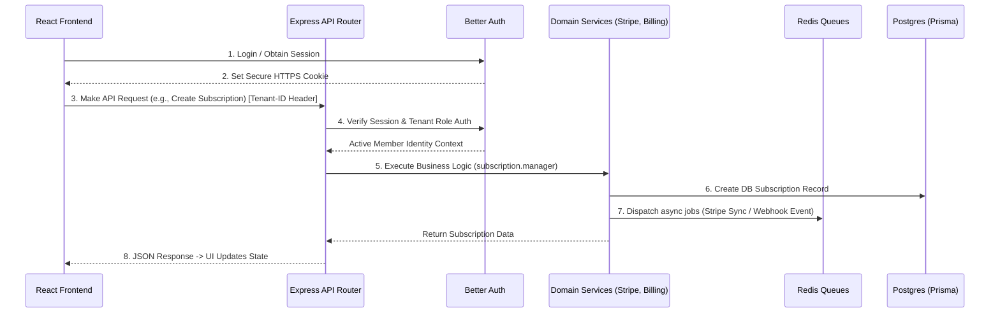
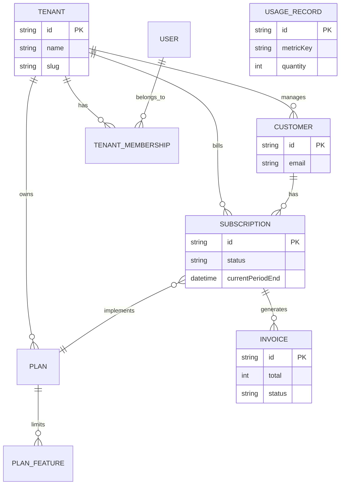

# BillFlow — Project Documentation

Welcome to BillFlow! This documentation is designed to give both **Customers** (end-users of the software) and **Developers** (those modifying or running the application) a complete understanding of how the platform operates. 

---

## Part 1: Customer Overview

**What is BillFlow?**
BillFlow is a comprehensive billing engine and workspace management platform designed to help companies manage their pricing models, customers, active subscriptions, usage metering, and invoicing.

**Core Capabilities for Users:**
- **Workspace & Team Management:** Easily create "Tenants" (workspaces) for your business. Invite your team members assigning them specific roles (Owner, Admin, Member, Viewer). 
- **Plan Configuration:** Dynamically configure your monthly and yearly pricing plans, defining specific feature limits across different tiers.
- **Customer Subscriptions:** Create customers, assign them to payment plans, and manage upgrades, downgrades, and cancellations.
- **Usage Metering:** For usage-based pricing models (e.g., "$0.02 per API call"), you can track raw usage data. The system automatically rolls it up into current billing windows.
- **Automated Invoicing:** Fully automated invoice calculation, with proration handling and tax alignment, generated each billing cycle.
- **Webhooks:** Hook up external services. Whenever an invoice is generated or a subscription cancelled, your external application can listen to the event immediately.

---

## Part 2: Developer Documentation

This section explains the internal mechanics, architecture, file structure, and technical flows of BillFlow. The project is split into a **Node.js/Express Backend** and a **React/Vite Frontend**, joined together by a **PostgreSQL Database** managed via **Prisma ORM**. It handles authentication using **Better Auth** and background queues with **Redis**.

### UML Architecture Diagram

Below is the interaction flow modeling how requests pass through the system:

### Entity Relationship Diagram (Database Schema)

---

### Core Data Flows & Request Lifecycle

When a frontend UI component needs data:
1. **Frontend Request:** `frontend/src/lib/api.ts` dispatches a standard `fetch` call, automatically attaching `X-Tenant-Id` headers so the backend knows which workspace context to use.
2. **Backend Router Context:** In `backend/src/app.ts`, requests hit the `authenticate` middleware. The backend parses cookies via Better Auth to verify user validity, and blocks access if the user is not a member of the requested Tenant ID.
3. **Service Layer Execution:** The controller passes validated inputs to a specific service (like `subscription.manager.ts`). Services directly communicate with `Prisma` to fetch or mutate data and handle Stripe synchronization.
4. **Asynchronous Backgrounding:** Immediate operations return quickly to the UI, while events (like calculating heavy invoices or dispatching webhooks) are pushed onto Redis using `bullmq` to be digested by the background workers gracefully.

---

### File-by-File Breakdown

#### `backend/` Directory (Node.js API)

| File / Folder | Purpose & Explanation |
|---|---|
| `prisma/schema.prisma` | The absolute source of truth for the database schema. Defines all tables (Tenant, Subscription, Plan, Usage) and relationships. |
| `src/app.ts` | The Express entry point. It wires up middleware, mounts all the routing files, configures CORS, and catches global errors. |
| `src/config/env.ts` | Centralizes and validates environment variables (checking for `DATABASE_URL`, `REDIS_URL`, etc.). Prevents the server from booting if secrets are missing. |
| `src/middleware/auth.ts` | Intercepts routes. Validates Better Auth sessions and asserts that the requesting user holds the right Role (`OWNER`, `ADMIN`, etc.) in the active Tenant. |
| `src/routes/*.ts` | The API endpoints (e.g., `/api/v1/subscriptions`). Controllers here simply extract HTTP params/JSON bodies and delegate exact behavior to the Services layer. |
| `src/services/subscription/manager.ts` | The core domain logic for subscriptions. Handles creating subscriptions, verifying plan compatibility, starting trial periods, and executing upgrades. |
| `src/services/invoice/generator.ts` | Complex algorithm file that tallies up subscription costs, handles proration logic for mid-cycle upgrades, applies taxes, and locks an `Invoice` into the database. |
| `src/services/billing/stripe.ts` | (Optional) bindings mapping BillFlow models natively to Stripe if automated payment capture is requested. |
| `src/jobs/*.ts` | Defines and instantiates BullMQ queues connected to Redis. Specifically parses raw Usage Records and executes async Webhook deliveries. |

#### `frontend/` Directory (React / Vite Web App)

| File / Folder | Purpose & Explanation |
|---|---|
| `src/App.tsx` | The root React component. Mounts the `BrowserRouter` and maps URL paths to components. Uses guards to automatically protect secure pages or redirect logged-in users away from the login page. |
| `src/types/index.ts` | Strict TypeScript models matching the backend payload shapes (Customer, TenantMember, Invoice, etc). Ensuring end-to-end type safety without guessing object structures. |
| `src/lib/api.ts` | The standard API client. Wrap standard `fetch()` mechanisms with domain-specific properties. Handwires the injection of the `X-Tenant-Id` header into all service requests. |
| `src/lib/auth.ts` | Better Auth frontend module. Hooks `useAuthSession` verify standard token validity, returning the currently logged-in User profile and all their accessible workspaces. |
| `src/components/Layout.tsx` | The universal structural wrapper for protected pages. Renders the permanent sidebar, dynamic routing NavLinks, and the all-important Tenant Switcher dropdown. |
| `src/components/Toast.tsx` | A bespoke, lightweight global notification provider providing `toast.success()` and `toast.error()` popups everywhere in the app. |
| `src/pages/Subscriptions.tsx` | (Example feature page). Combines `useQuery` to fetch all subscriptions for the tenant, renders heavily interactive data tables, and manages modals for "Upgrading" or "Cancelling". |
| `src/pages/*` | All other specific domain interfaces (Plans, Invoices, Team Settings, Usage Meters) operating under the exact same pattern as the aforementioned Subscriptions page. |
| `src/index.css` | A pure, extremely semantic vanilla CSS file containing the UI design system. Defines grid layouts, badge colors, modern UI gradients, responsive media-queries, and variable tokens (avoiding the need for heavy frameworks like Tailwind). |

---

### Starting the Project Locally

Because developers shouldn’t need any additional documentation, here is the immediate process to work on the app.

1. Ensure Docker is running on your machine.
2. In the root, run `docker compose up -d` to securely stand up PostgreSQL and Redis instances.
3. In `backend/`, copy `.env.example` to `.env`. Ensure your `DATABASE_URL` matches the docker credentials.
4. Run `npx prisma migrate dev` to deploy the exact database structures mapping the ORM relationships.
5. Boot the backend using `npm run dev` in the `backend/` folder.
6. Boot the frontend using `npm run dev` in the `frontend/` folder.
7. Open `http://localhost:5173`. Make an account. Click **Generate Sample Data** in the Dev Mailbox screen.

This grants you an instantaneous, fully-functioning billing engine locally populated with realistic dummy data.
